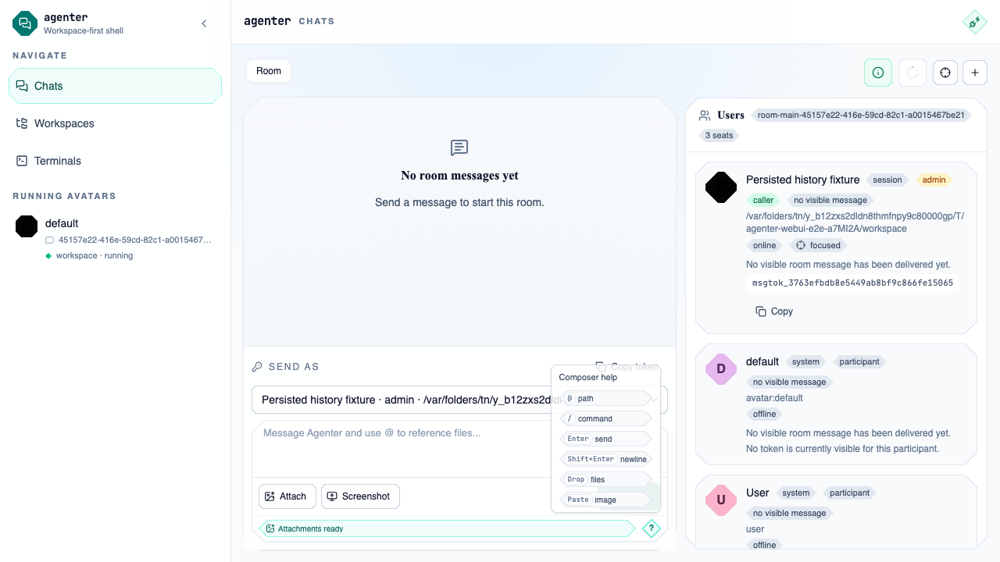
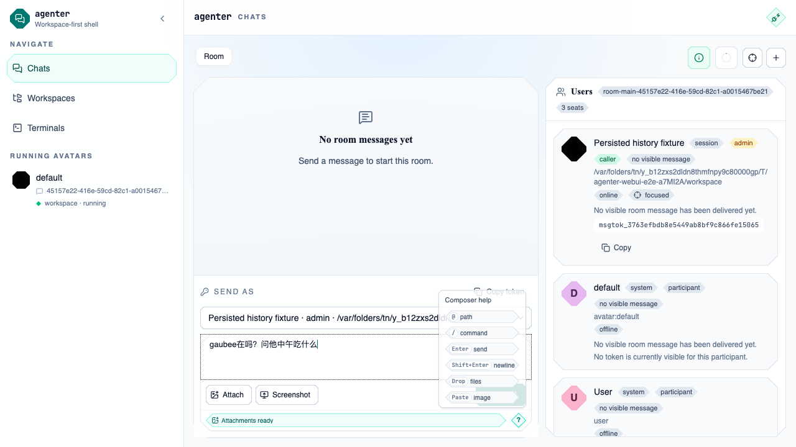
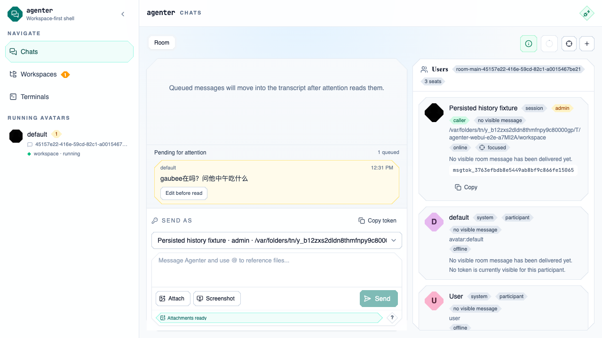
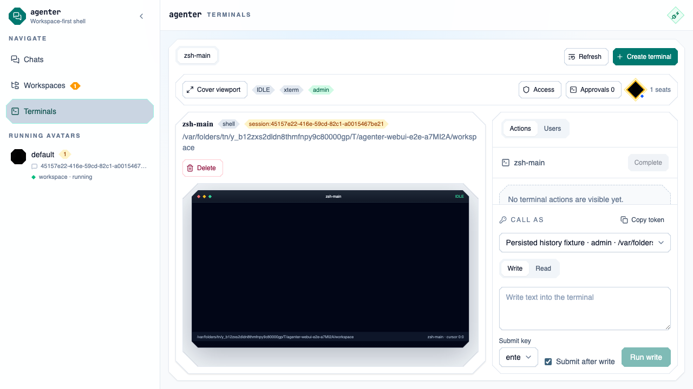
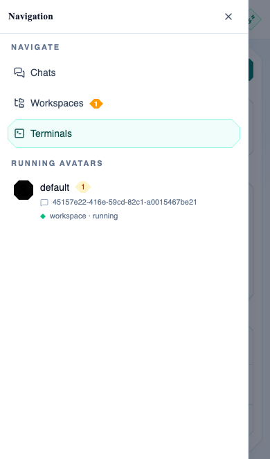
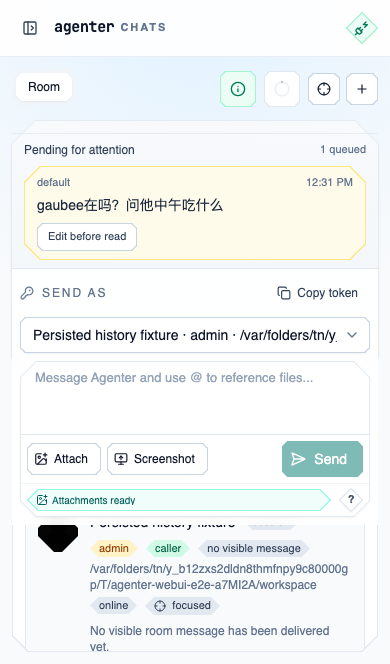

# Dogfood Report: agenter WebUI

| Field | Value |
|-------|-------|
| **Date** | 2026-04-01 |
| **App URL** | http://127.0.0.1:59001 |
| **Session** | agenter-vnext-dogfood |
| **Scope** | cross-change auth + message + terminal collaboration dogfood |

## Summary

| Severity | Count |
|----------|-------|
| Critical | 0 |
| High | 3 |
| Medium | 0 |
| Low | 0 |
| **Total** | **3** |

## Rerun Verification

| Field | Value |
|-------|-------|
| **Date** | 2026-04-01 |
| **App URL** | http://127.0.0.1:64411 |
| **Session** | agenter-vnext-desktop |
| **Model Mode** | real |
| **Result** | All three previously blocking issues did not reproduce on desktop or `iPhone 14` after the fix set in this turn. |

- `ISSUE-001` resolved in rerun: sending `gaubee在吗？问他中午吃什么` now lands in the room transcript immediately, ordered by send time, without any `Pending for attention` affordance.
- `ISSUE-002` resolved in rerun: the terminal route no longer leaks `.terminal-stage`, `.terminal-frame`, or xterm renderer CSS into the page body.
- `ISSUE-003` resolved in rerun: on `iPhone 14`, navigating from `Terminals` to `Chats` now yields a clean chat body with no stale terminal content underneath.

## Issues

<!-- Copy this block for each issue found. Interactive issues need video + step-by-step screenshots. Static issues (typos, visual glitches) only need a single screenshot -- set Repro Video to N/A. -->

### ISSUE-001: Room message stays queued and never reaches transcript

| Field | Value |
|-------|-------|
| **Severity** | high |
| **Category** | functional |
| **URL** | http://127.0.0.1:59001/chats |
| **Repro Video** | N/A |

**Description**

After onboarding succeeds and the user opens Chats, sending a room message leaves the conversation in a `Pending for attention` / `1 queued` state. Even after waiting 10 seconds in a real-model harness, the message never moves into the visible transcript and the room still reports that no visible message has been delivered yet. This blocks the core room collaboration path.

**Repro Steps**

1. Open Chats after signing in successfully.
   

2. Type `gaubee在吗？问他中午吃什么` into the room composer.
   

3. Click `Send`.
   

4. Wait 10 seconds and observe that the room still shows `Pending for attention`, `1 queued`, and `No visible room message has been delivered yet`.
   

---

### ISSUE-002: Terminal route leaks raw CSS and xterm renderer text into the page body

| Field | Value |
|-------|-------|
| **Severity** | high |
| **Category** | visual |
| **URL** | http://127.0.0.1:59001/terminals |
| **Repro Video** | N/A |

**Description**

The terminal workbench renders large chunks of raw CSS and xterm renderer output as visible page text. Instead of only showing the terminal surface and collaboration chrome, the page body contains the stylesheet source for `.terminal-stage`, `.terminal-frame`, `.xterm-dom-renderer-owner-*`, and related rules. This breaks the primary terminal reading experience.

**Repro Steps**

1. Navigate to the Terminals page after onboarding.
   

2. Wait for the terminal route to finish loading.
   

---

### ISSUE-003: Mobile navigation switches to /chats but leaves terminal content visible underneath

| Field | Value |
|-------|-------|
| **Severity** | high |
| **Category** | functional |
| **URL** | http://127.0.0.1:59001/chats |
| **Repro Video** | N/A |

**Description**

On mobile, using the navigation drawer to move from `Terminals` to `Chats` changes the URL and interactive controls to the chat route, but the page body still contains the terminal page content, including the leaked terminal CSS and terminal workbench text. The result is a mixed or stale route body that makes the mobile navigation path unreliable.

**Repro Steps**

1. On mobile viewport, open the navigation drawer from the terminal route.
   

2. Tap `Chats` in the drawer.
   

3. Observe that the URL is `/chats`, but the page body still shows terminal content instead of a clean chat body.
   

---
