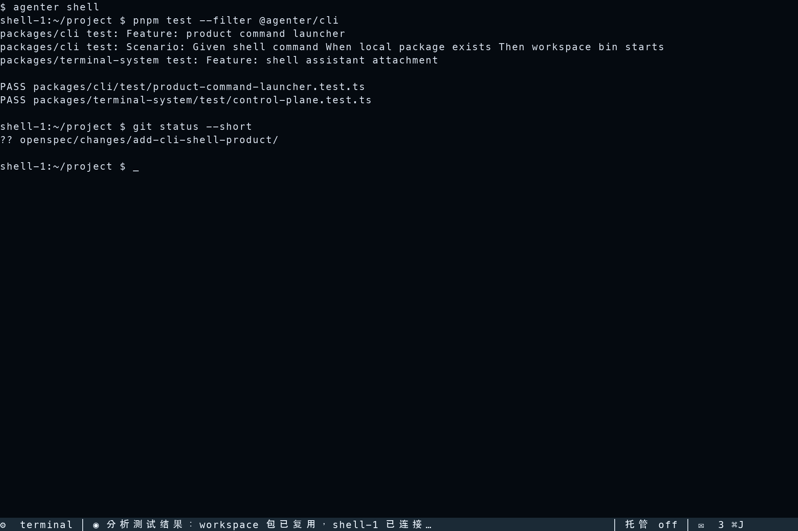
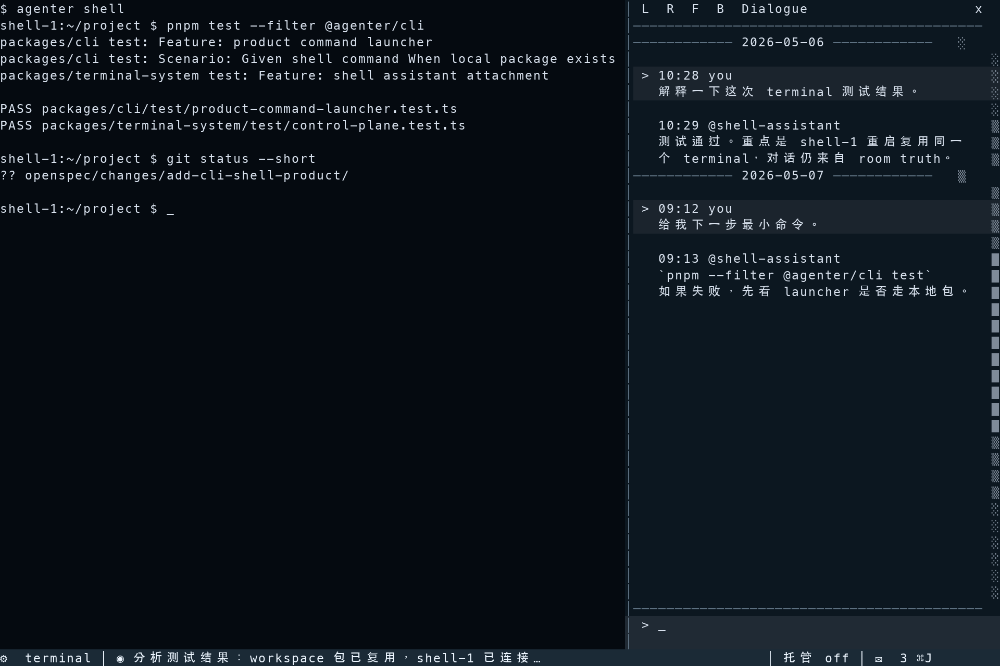

## Context

Agenter already has strong backend truths for global terminals, global rooms, AvatarRuntime identity, and superadmin WebUI operation. The new `agenter shell` product should reuse those truths rather than create a second local shell authority.

This change is not primarily a one-off cli-shell implementation. Roughly half of the change is to define the programmable product-extension capability that lets ordinary-user products attach to Agenter without polluting core modules. `@agenter/cli-shell` is the first verification extension for that capability. Core packages may know a product descriptor and capability envelope, but they must not import cli-shell implementation, branch on cli-shell UI semantics, or store cli-shell-only state in core runtime tables.

The user-facing entry is:

```bash
agenter shell
agenter shell --session=2
agenter shell --session=prod
agenter shell @default
agenter shell @default --session=prod
```

In this grammar, omitting `@avatar` summons the dedicated terminal assistant Avatar `@shell-assistant` into the product room. An explicit mention such as `@default` remains a supported override. `--session` is not an Agenter runtime session. It is only the cli-shell product's terminal naming input: `1` maps to the terminal name/id `shell-1`.

Terminology in this change:

- `shell-terminal`: the user's real terminal window/process that runs `agenter shell ...`.
- `terminal`: an internal `terminalSystem` terminal instance managed by Agenter backend truth.

One `shell-terminal` attaches to exactly one internal `terminal`. Cli-shell does not manage multiple internal terminals inside one shell-terminal; users create another shell-terminal by launching `agenter shell --session=<name>` in another terminal process, optionally with an explicit `@avatar` override.

Corrected prompt distillation:

- Stable TUI law: collapsed cli-shell renders only one bottom toolbar row. The toolbar is `status icon | current Heartbeat | actions`.
- Stable TUI law: the Heartbeat area is a streaming projection of the latest visible Heartbeat message-part; message, terminal, and attention built-in tool activity receive compact summaries in that projection.
- Stable TUI law: the actions are limited to managed/takeover and chat entry. The chat entry shows unread count, supports a shortcut, and opens the dialogue panel.
- Stable extension law: managed/takeover is platform-backed, not a local toolbar boolean. Enabling it creates hosting attention for scheduling and, when autonomous terminal operation is allowed, a bounded delegation lease for terminal write authority with explicit expiry and provenance.
- Stable TUI law: the dialogue panel is explicit chrome, not default chrome. It has a top toolbar, Markdown message list, and focused bottom input. For review, the current reference draws it on the right.
- Stable TUI law: dialogue placement supports left, right, floating, and bottom. First open and resize use deterministic smart placement with minimum viable thresholds.
- Stable TUI law: cli-shell is terminal software, not a Web surface. The reference and implementation must treat the shell-terminal as a character-cell grid; borders, gutters, scrollbars, controls, backgrounds, and highlights are all character-cell projections rather than sub-cell pixel cards.
- Stable TUI law: docked dialogue placements are separated, not framed. Right/left placement should use a vertical split; bottom placement should use a horizontal split. The panel should not waste cells on a full enclosing border unless it is floating over terminal content.
- Stable TUI law: dialogue messages render short time metadata. When adjacent messages cross a date boundary, the list inserts a standalone centered date divider row before the first message on the new date.
- Stable platform law: daemon discovery and startup must reuse the existing CLI/daemon/auth-service contract. The early prompt's description of `~/.agenter` port discovery is historical context unless it is already part of the platform daemon law; cli-shell should consume the launcher-provided daemon context instead of inventing another discovery authority.
- Stable agent law: the summoned assistant defaults to the dedicated Avatar `@shell-assistant`. Cli-shell should ensure or create that Avatar through generic Avatar/product-extension APIs when missing. Explicit command mentions such as `@default` override the default and remain supported. This is cli-shell extension grammar and orchestration, not core launcher behavior.
- Stable prompt/memory law: auto-created `@shell-assistant` has an `AGENTER.mdx` prompt source that describes a flexible pair-programming relationship and the assistant's long-lived self-evolution. Self-evolution is orthogonal to managed mode: it can happen during normal conversation, user correction, post-work review, or a product/assistant-composed attention-cli loop such as a user-defined nightly reflection. `auto-dream` is only an example name for such a loop, not a built-in core feature or fixed score key. That prompt should strongly reference a dedicated memory pack so context compaction does not erase the assistant's accumulated fit or the current hosting objective, but the underlying prompt and memory files remain openly editable user assets rather than locked product-owned state.
- Stable hosting law: turning managed mode on commits a product-scoped AttentionItem with the literal fixed score key `scores: {"hosting": 1000}`. This score is the scheduling obligation. The Avatar decides, from prompt, memory, user intent, and current evidence, whether to keep watching indefinitely or settle the obligation by committing `hosting: 0`. Turning managed mode off from cli-shell always commits `hosting: 0`.
- Stable evaluation law: self-evolution quality cannot be fully verified by deterministic assertions. Implementation must add real AI semantic-judge evaluation with a rubric, threshold, and bounded retry before judging shell-assistant prompt/memory evolution as acceptable.
- Stable real-AI testing law: deterministic unit tests remain necessary, but prompt usefulness, learning, and self-evolution direction require long-running real AI scenario scripts. These tests may be gated from normal CI and may use the existing model-response cache, but they are the meaningful acceptance path for the assistant's learned behavior.
- Stable governance law: prompt tuning must not overfit a narrow evaluation fixture. If implementation exposes contradictions between the ideal design and real behavior, record them under `.chat/add-cli-shell-product/` instead of hiding them behind a test-specific prompt patch.

Current product references:

Final v8 design reference, collapsed default:



Final v8 design reference, dialogue panel open on the right:



Paired source and terminal-grid auxiliary references:

- `assets/cli-shell-product-reference-v8-toolbar-grid.svg`
- `assets/cli-shell-product-reference-v8-toolbar-grid.txt`
- `assets/cli-shell-product-reference-v8-dialogue-right-grid.svg`
- `assets/cli-shell-product-reference-v8-dialogue-right-grid.txt`

Reference notes:
- The v8 PNGs are the accepted final-review product-effect references for this change.
- The v8 SVG files are deterministic companions for inspection and regeneration; they must remain visually subordinate to the terminal-grid law rather than becoming Web/pixel design targets.
- The v8 text grids are the objective auxiliary contracts for rows, columns, borders, gutter, scrollbar, time, and date-divider placement.
- Earlier v1-v7 exploration images were removed from the final asset set. Their rejected decisions remain captured in Decision 7 alternatives without keeping stale assets.

## Goals / Non-Goals

**Goals:**

- Define a generic product-extension runtime capability that future ordinary-user products can reuse without adding new core-product coupling.
- Let `agenter shell` automatically launch the external `@agenter/cli-shell` product package.
- Default cli-shell to the dedicated terminal assistant Avatar `@shell-assistant`, while preserving explicit `@avatar` overrides such as `@default`.
- Initialize `@shell-assistant` with a product-specific `AGENTER.mdx` and dedicated memory files for pair-programming fit, learned user preferences, terminal habits, self-evolution, and current hosting objectives.
- Let self-evolution use the generic attention programmable surface, including minimal attention-cli `commit/query/settle` operations, so a user or assistant can compose reflection loops without core adding named features like `auto-dream`; richer `watch/schedule` loop primitives are deferred to `extend-attention-cli-self-evolution-runtime`.
- Resolve local workspace packages first so monorepo tests can exercise `packages/cli-shell` without publishing to npm.
- Auto-start or reuse the daemon using the same host/port/auth-service law as existing CLI products.
- Default to superadmin auto-login for ordinary local product use.
- Make `@agenter/cli-shell` attach to durable backend terminal and room truth.
- Keep `--session` scoped to cli-shell terminal naming, not AvatarRuntime identity.
- Present an SSH-like TUI that preserves the shell-terminal as the primary working space for one active internal terminal.
- Keep the default Agenter surface bottom-only, one-line, compact, and non-invasive.
- Render the one-line toolbar in three zones: status icon, current heartbeat, and action buttons.
- Provide an explicit TUI dialogue panel for room conversation when the user opens it.
- Prove the extension runtime through cli-shell: launcher context, resource binding, attention projection, delegation lease, terminal write provenance, and detach/reconnect must all work through programmable interfaces.
- Prove shell-assistant self-evolution through long-running real AI semantic-judge tests that evaluate user-fit learning, memory update quality, collaboration-style adaptation, orthogonality, hosting separation, and absence of test overfitting.

**Non-Goals:**

- Do not make `shell` an ordinary hard-coded subcommand that directly embeds cli-shell implementation in `@agenter/cli`.
- Do not let core packages import `@agenter/cli-shell` or carry cli-shell-specific branches, view models, toolbar state, terminal naming rules, or layout rules.
- Do not create another browser-local or terminal-local shell truth.
- Do not make `--session` create a new AvatarRuntime session.
- Do not require users to install `@agenter/cli-shell` manually before `agenter shell` can run.
- Do not replace the superadmin WebUI; cli-shell is a focused ordinary-user product.
- Do not build a multi-terminal manager inside one shell-terminal.
- Do not add a left shell/session rail or a persistent right chat transcript pane to the default shell mode.
- Do not add top chrome, top status, route tabs, or dashboard framing around the terminal.
- Do not make the Agenter dialogue panel a default always-open dashboard.
- Do not replace the required toolbar zones with a freeform `agt>` prompt.

## Decisions

### 1. Core CLI owns product package resolution, not product behavior

The core `agenter` CLI will keep first-party daemon/auth-service bootstrapping and add a small product launcher. The launcher maps product command `shell` to package `@agenter/cli-shell`, resolves the package bin, and forwards arguments and connection settings.

This mapping must remain descriptor-driven. The core launcher may own a controlled product registry entry, but the registry entry is data: command name, package name, bin/capability hints, and launch policy. It must not become `if (command === "shell")` product logic. Adding another ordinary-user product should add another descriptor and product package, not another hard-coded branch in runtime/core modules.

Alternative considered:
- Put shell directly into `packages/cli/src/run-cli.ts`.
  - Rejected because it would make every future product another core CLI branch and would couple product UX to platform bootstrapping.

### 2. Package resolution is local-first, then installed, then remote

Resolution order:

1. workspace package under `packages/cli-shell`
2. installed package resolvable from the current runtime
3. remote npm fallback through the configured package runner

This lets local tests launch the workspace implementation while published users get automatic npm execution.

The current CLI runtime is Bun-based, so the default remote runner can be `bunx @agenter/cli-shell`. The launcher still owns this behind a runner abstraction so tests can assert command construction and future non-Bun runtimes can override it without changing the product command law.

Alternative considered:
- Always use remote package execution.
  - Rejected because it makes monorepo tests depend on published packages and breaks local product iteration.

### 2.1 Product process context is explicit env, not ambient rediscovery

The launcher should pass daemon/auth/product context through stable environment variables to avoid each product rediscovering platform state differently:

- `AGENTER_DAEMON_HOST`
- `AGENTER_DAEMON_PORT`
- `AGENTER_AUTH_SERVICE_ENDPOINT` when the daemon is using an external auth-service bridge
- `AGENTER_PRODUCT_COMMAND`
- `AGENTER_PRODUCT_PACKAGE`
- `AGENTER_PRODUCT_SOURCE` as `workspace`, `installed`, or `remote`

Products may also accept mirrored CLI flags for direct testing, but the env contract is the launcher-owned truth.

### 2.2 Product extension runtime is the platform law cli-shell validates

Cli-shell must consume a generic extension surface instead of reaching into core internals. The extension surface has five programmable planes:

1. Launch context: daemon endpoint, auth bridge, product descriptor, source, argv, and inherited stdio.
2. Resource binding: generic `productId + resourceKey` APIs that ensure or look up terminal and room resources through their owning systems.
3. Attention projection and mutation: product-scoped attention contexts/items, minimal attention-cli compatible commit/query/settle operations, and Heartbeat stream projection, without hidden prompt side channels.
4. Assistant initialization: product-driven Avatar ensure, prompt-source ensure, and memory-pack ensure through generic Avatar/workspace resource APIs.
5. Delegation: explicit user-granted leases that authorize an Avatar to autonomously operate a resource for a bounded time and policy.

Core owns these planes as platform interfaces. Cli-shell owns only its product grammar and presentation: `@avatar` parsing, `@shell-assistant` defaulting, `AGENTER.mdx`/memory pack initialization, `--session` normalization to `shell-<name>`, terminal-grid UI, toolbar semantics, and dialogue placement.

Because cli-shell is an external product process, the implementation must consume these planes through daemon/client-sdk style contracts. Local workspace package resolution may use source packages for testing and development, but it must not become permission to import core runtime internals from `@agenter/cli-shell`. The extension boundary should still be visible when the package is published or removed.

Alternative considered:
- Let cli-shell call a set of internal helper functions that happen to create terminals, rooms, focus, and takeover state.
  - Rejected because that would make cli-shell the hidden second product engine and would force every future product to copy or depend on cli-shell-specific glue.

### 3. Product session name maps only to terminal identity

`--session=1` resolves to `shell-1`; `--session=prod` resolves to `shell-prod`. This name is a product terminal identity. It must never feed `session.create.name` as a new AvatarRuntime identity axis.

Alternative considered:
- Treat `--session` as an Agenter runtime session name.
  - Rejected because AvatarRuntime identity is avatar-first, and this would recreate the old `workspace + avatar + session` multiplication bug.

### 4. Cli-shell uses ensure-style orchestration over backend truth

The product should list before creating:

- If terminal `shell-1` exists, focus and attach it.
- If it does not exist, create it through the backend terminal control plane.
- If room metadata identifies an existing cli-shell room for `shell-1`, reuse it.
- If no room exists, create one with backend-allocated room id and product metadata.

The product must not rely on terminal create being idempotent; current terminal-system rejects duplicate terminal ids.

These operations should be expressed through generic product resource binding APIs. The API input should use product namespace and product resource key, for example `productId=cli-shell`, `resourceKey=shell-1`, and desired resource kinds. The core API may store product metadata, but it must not understand `--session`, `shell-1`, toolbar labels, or right-side dialogue placement. Those are extension-owned semantics.

Alternative considered:
- Blindly call create on every launch.
  - Rejected because repeated `agenter shell` must reconnect to the same terminal instead of failing or duplicating state.

### 5. Superadmin is the default product seat, `@shell-assistant` is the default agent seat

The product logs in as superadmin by default. It uses that authority to ensure the terminal and room exist, then grants or focuses the selected Avatar principal onto those resources so the Avatar can observe and participate through backend systems. When the command omits an Avatar mention, the selected Avatar is `@shell-assistant`; when the command includes a mention, that explicit Avatar wins.

When cli-shell auto-initializes `@shell-assistant`, it seeds missing defaults but does not try to lock or own the underlying prompt and memory files. Advanced users may manually edit those low-level files. The initializer should stay simple: create missing scaffolds, read existing content as the current truth, and avoid a reconciliation loop that fights user edits. The default prompt belongs in the Avatar prompt source path resolved for that Avatar, normally `AGENTER.mdx`. It should not script one fixed collaboration style. The prompt is a force field: it biases the Avatar toward learning the user's preferences, instructions, habits, and thinking style, then adapting its autonomy level over time.

In plain terms, there are two different memory lifetimes:

1. Long-lived self-evolution memory: "who is this user, how do they think, what habits and instructions should I carry forward, what skills should I improve?"
2. Current hosting objective memory: "right now managed mode is on for this terminal; what am I watching or trying to finish, what progress exists, and when can `hosting` go to zero?"

The first lifetime has nothing to do with managed mode. A user can ask `shell-assistant` to compose a reflection loop at midnight, review the day, and update skills or memory while managed mode is off. That loop can be built from normal conversation, skills, memory, and attention-cli operations. `auto-dream` is only one possible user-defined name for such a loop; the kernel must not reserve it as a product feature. The second lifetime exists only for an active or recently settled hosting obligation.

The dedicated memory pack should live in the shell-assistant avatar-private memory domain exposed by WorkspaceSystem. The implementation can choose exact storage roots using existing workspace/avatar asset APIs, but the default pack needs at least these durable roles:

- `user-model`: durable user preferences, instructions, corrections, constraints, and decision style.
- `pairing-playbook`: how this user likes to pair, including autonomy level, review cadence, interrupt style, and when to ask before acting.
- `terminal-habits`: shell commands, tooling, project conventions, failure patterns, and terminal operating habits learned from observation.
- `self-evolution-log`: distilled reflection outcomes, skill gaps, successful adaptations, and future improvement directions, including assistant/product-composed reflection loops.
- `hosting-objective`: the current managed-mode goal, watch policy, progress notes, known stop conditions if any, and why the `hosting` score is still non-zero.

`AGENTER.mdx` must name these memory roles explicitly and tell the Avatar to read/update them at relevant boundaries, especially after user correction, after a meaningful terminal workflow is learned, after scheduled self-review, and immediately after managed mode is enabled. Memory is not a prompt transcript dump; it is distilled operational knowledge that survives compact.

Alternative considered:
- Make the product use only Avatar credentials.
  - Rejected for v1 because the ordinary local CLI product needs a zero-friction bootstrap and the user explicitly wants default superadmin login.

### 5.1 Collaboration style is learned, not classified

`shell-assistant` must treat pair programming style as a learned relationship, not a hard-coded user archetype. The prompt and memory pack should mention possible collaboration shapes only as examples of variance:

- A senior engineer may prefer to stay in the lead, use the assistant as a reviewer/operator, and expect minimal initiative unless delegated.
- A junior engineer may mainly state goals and rely on the assistant to drive more planning, implementation, and explanation.
- A playful user may interact with the assistant as a companion-like presence, while the assistant still preserves durable engineering and safety boundaries.

These are not product modes, prompt branches, or scoring labels. They are examples used to force the Avatar to observe the actual user, update `user-model` and `pairing-playbook`, and adapt its autonomy, interruption, explanation, and review cadence from evidence.

### 5.2 Self-evolution uses the programmable attention surface

Because this change upgrades kernel programmability, self-evolution should not be limited to static prompt text. For `add-cli-shell-product`, the product-extension runtime should expose enough minimal attention-cli compatible operations for products, skills, or assistants to:

- commit a self-evolution attention context or item,
- query unresolved reflection or learning obligations,
- settle a reflection obligation after memory/skill updates are complete.

This keeps `auto-dream`-style behavior in the composable layer. A user can teach `shell-assistant` a named loop, and the assistant can implement the current version with attention-cli plus memory/skill usage when the wakeup source already exists. Dedicated `watch` and future `schedule` primitives belong to the follow-up proposal `extend-attention-cli-self-evolution-runtime`, not to the first cli-shell product implementation. Core should only provide generic attention operations and scheduling laws; it should not branch on `auto-dream`, nightly reflection, or any other named self-evolution ritual.

### 5.3 Real AI evaluation and anti-overfit governance

Shell-assistant self-evolution is semantic behavior. Deterministic tests can verify files were written, APIs were called, and attention scores changed, but they cannot prove the assistant learned the right thing or evolved in the right direction. This change therefore requires long-running real AI evaluation using the existing semantic judge tooling (`SemanticJudge`, `judgeStructured`, real semantic judge test support, and the model-response cache).

The self-evolution evaluation should run scenario traces through a structured judge rubric. The minimum rubric dimensions are:

- user-fit learning: did the assistant infer the user's durable preferences and collaboration style from evidence?
- memory quality: did it write concise operational memory rather than raw transcript dumps?
- self-evolution direction: did it identify useful skill/prompt/memory improvements without inventing false facts?
- orthogonality: did it preserve product/core isolation, attention/delegation separation, and terminal truth ownership?
- hosting separation: did it keep self-evolution independent from managed mode and use `hosting` only for hosting obligations?
- programmable attention usage: did it use or propose attention-cli compatible loops for reflection instead of requiring a core special case?
- anti-overfit: did the behavior generalize across collaboration styles instead of matching a narrow fixture phrase?

Scoring should be numeric. A default pass threshold should be explicit in the test, for example `score >= 0.8` on a `0..1` rubric. If the judge score is below threshold, the scenario may retry to absorb model variance. If two retries still fail, the failure is considered a real product issue requiring prompt adjustment or bug repair.

Prompt adjustment has a hard constraint: do not tune `AGENTER.mdx` to pass one test fixture at the cost of the orthogonal design law. If implementation reveals a real contradiction, such as "the prompt needs a test-specific instruction to pass but that instruction narrows future behavior," record the contradiction under `.chat/add-cli-shell-product/` with evidence, then decide whether the platform law, prompt law, or test rubric needs revision.

Normal CI may keep these real AI suites disabled or cache-backed because they are slow and partially stochastic. That does not make them optional as product validation. The implementation should generate a long-script scenario suite that simulates extended use over many turns: terminal observation, user correction, multiple collaboration styles, compact/restart continuity, memory revision, and later behavior that proves the learned memory is actually being used.

### 6. Room ids remain backend-allocated principal ids

Cli-shell should not create room ids such as `shell-1`. Message-system requires valid principal-backed room ids. The stable product identity should live in room metadata such as:

```json
{
  "product": "cli-shell",
  "shellName": "shell-1",
  "avatar": "shell-assistant"
}
```

The visible title can still be `shell-1`.

Alternative considered:
- Use `shell-1` as the `chatId`.
  - Rejected because it violates the room id allocation law.

### 7. Visual IA stays shell-terminal-preserving

The first screen is the usable product, not a landing page. The shell-terminal should remain recognizably a normal terminal: ordinary terminal content owns the full screen except for a one-row Agenter dock at the bottom. The default dock is one terminal row, distinguished preferably by background color. A separator line is optional and should be treated as a theme affordance, not a second mandatory content row.

All visible cli-shell UI is drawn as terminal cells. The design target is not a Web mock projected into a terminal. Borders are box-drawing or ASCII characters, gutters and scrollbars are columns, backgrounds are cell-range attributes, buttons are focused/selectable text cells, and panel placement is expressed in rows and columns. Implementations may use OpenTUI primitives, but the final render must be explainable as a rectangular cell grid with deterministic width accounting, including wide emoji/CJK glyphs through terminal `wcwidth`-style measurement.

For docked dialogue placement, the cell-grid law favors separators over boxes. A right or left dialogue panel should reserve one vertical split column between terminal content and dialogue content, then use internal horizontal separators for toolbar/list/input regions. A bottom dialogue panel should reserve one horizontal split row between terminal content and dialogue content. It should not draw a complete outer rectangle around the docked chat panel, because every border cell steals usable terminal/chat space and makes the product read like Web chrome. Floating placement is the exception: because it overlaps terminal content, it may use a minimal outline or shadow-like cell treatment to preserve legibility.

The one-row toolbar has exactly three semantic zones:

1. Status icon: compact state display, usually emoji-based.
2. Current heartbeat: the last message-part from the current Heartbeat, updated as streaming output arrives.
3. Action buttons: a managed/takeover toggle and a chat entry button with unread count and shortcut hint.

The toolbar should not become a generic status dashboard. Backend facts such as terminal id, room id, package source, auth mode, and daemon status belong in diagnostics or debug surfaces unless the Heartbeat itself is reporting them.

Room state is a projection over backend message truth. Cli-shell should provide an Agenter dialogue panel, and for the current product reference that panel opens on the right side. It is not persistent default chrome and not part of the collapsed one-row toolbar.

Product status belongs in the bottom dock; it must not become top chrome.

Cli-shell must not show a `SHELLS` or `SESSIONS` rail. `SHELLS` still implies in-product shell switching, which is wrong for this product law. If the user wants `shell-2`, they run another `agenter shell --session=2` shell-terminal.

Alternative considered:
- Reuse the current generic `@agenter/tui` session list layout or the v2 left-rail layout.
  - Rejected because it preserves the old runtime-session mental model and overstates shell mode's ownership of terminal management.
- Use the v3 top status line plus bottom activity strip.
  - Rejected because the user explicitly wants only bottom intrusion.
- Use the v4 2-3 row bottom strip without a dialogue panel.
  - Rejected because the default intrusion should be one line, and the product still needs an explicit dialogue panel.
- Use the v5 bottom dialogue panel and status-heavy dock.
  - Rejected because the dock content was too busy and the dialogue panel should be drawn on the right for product review.
- Use the v6 `agt>` prompt dock.
  - Rejected because the corrected prompt requires toolbar zones: status icon, current Heartbeat, and action buttons.

### 7.1 Toolbar status and heartbeat semantics

The status icon represents the current assistant activity state. The icon can use emoji because terminal users scan compact status quickly. The durable states are:

- idle
- progressing text output
- thinking
- tool call
- message tool operation
- terminal tool operation

The current Heartbeat text is the last visible message-part emitted by the active Heartbeat. It should stream in place rather than append rows. Built-in tool calls should be summarized for toolbar readability:

- message cli/tool activity should read as message operation
- terminal cli/tool activity should read as terminal operation
- attention cli/tool activity should read as attention/heartbeat operation

The toolbar should preserve raw truth elsewhere; the heartbeat text is a projection, not the event log.

### 7.2 Toolbar action buttons

The toolbar action zone has two buttons:

- Managed/takeover toggle: allows the assistant to take over terminal operation when enabled.
- Chat entry: envelope-style button, shows unread message count, supports mouse click and keyboard shortcut, and opens the TUI dialogue panel.

The unread count belongs on the chat entry because it is user attention state, not backend resource identity.

The managed/takeover toggle is only the view projection of platform facts. Turning it on commits a product-scoped hosting AttentionItem for the selected Avatar with the literal fixed score key `scores: {"hosting": 1000}` and product provenance naming the terminal, room, product id, shell name, and granting user. V1 managed mode is write-capable by default because replacing the user in terminal work is the core value of hosting. Therefore enabling managed mode also creates or refreshes a bounded terminal-write delegation lease that names the terminal, room, summoned Avatar principal, granting user principal, product id, shell name, expiry, and policy. Future policy variants may support observe-only or confirm-before-write modes, but those are not the v1 default and must not weaken the default hosting meaning. Turning it off revokes only the active lease and MUST commit a hosting update with `hosting: 0` and reason `user_disabled`. The toolbar must render platform projection, not own managed truth.

When managed mode is inactive, the Avatar may observe, explain, chat, learn user habits, and request approval, but it must not autonomously write to the terminal. When `hosting` remains positive, terminal idle/dirty observations and unresolved attention can legitimately self-schedule follow-up model rounds. The Avatar may keep `hosting` positive for open-ended watch tasks, or lower it to `0` only after it has actually decided the hosting obligation is settled. Terminal writes still require a valid delegation/terminal-native approval and must execute as the Avatar actor under that lease. Superadmin may bootstrap the product, but superadmin must not become the hidden actor for autonomous terminal effects.

### 8. Terminal input remains the default input owner

Cli-shell is a terminal attachment first. Printable keys, arrows, paste, and terminal control keys such as `Ctrl+C` should route to the attached backend terminal by default. The bottom Agenter composer is a secondary mode entered only through an explicit product keybinding.

V1 default proposal:

- Terminal mode is the default after launch and after every Agenter message send.
- A configured product focus gesture enters the bottom Agenter composer.
- `Escape` leaves the Agenter composer without sending.
- `Enter` sends only when the Agenter composer is focused; otherwise it is terminal input.
- `Ctrl+C` belongs to the attached terminal in terminal mode and must not exit cli-shell.

The keybinding is settings-driven from the start. A default such as `Ctrl+G` may be used by configuration, but the durable invariant is that product keys are explicit and ordinary terminal interaction is not intercepted by accident.

### 9. Dialogue panel is an explicit TUI conversation surface

The Agenter dialogue panel is the room conversation surface. For review, the current reference draws it on the right side. The panel should visually read as a conversation: user messages, Avatar replies, Markdown rendering, scroll position, and a message input area.

The panel has three regions:

1. Top toolbar: left-side layout buttons and right-side close button.
2. Middle message scroll list: terminal-rendered Markdown, left gutter, and right scrollbar.
3. Bottom input box: one-line separated area with gray background, left `>` gutter, focused cursor by default.

Docked panel boundaries are separators, not a full surrounding frame. In right placement, the panel uses the left vertical split to separate terminal and dialogue content, a top toolbar/list separator, and an input separator. It does not draw a redundant top/right/bottom outer border. In bottom placement, the same law rotates: one horizontal split separates terminal and dialogue content, with internal separators for toolbar/list/input.

User-authored messages use gray background and a `>` marker in the left gutter. Assistant messages render as Markdown without becoming terminal output.

Message metadata is compact. Each message group shows a short local time token, such as `10:28`, near its author/header/gutter area. The short time is a projection of message creation time and does not replace durable message timestamps. If the next visible message belongs to a different local date than the previous visible message, the list inserts one independent centered date divider row before that message. The divider is view chrome, not a message record.

The collapsed default state remains one bottom row. Opening and closing the dialogue panel should not create, delete, or rename terminal/room resources; it is a view state over the existing room truth.

### 9.1 Dialogue panel placement modes

The dialogue panel supports four placement modes:

- left
- right
- floating
- bottom

The first open uses smart placement based on available shell-terminal space:

- If horizontal space is sufficient, default to right.
- If vertical space is sufficient, default to bottom.
- Otherwise default to floating.

Smart placement also runs on resize. Each placement has a minimum viable space threshold; for example, a right-side panel needs a minimum horizontal width before smart placement should move it. Exact threshold values belong in implementation settings, but the behavior must be deterministic and testable.

### 10. Shell-terminal geometry drives backend terminal geometry

The shell-terminal viewport is split into terminal rows plus bottom Agenter rows. Cli-shell should compute backend terminal dimensions from the visible shell-terminal size:

- backend terminal cols = shell-terminal cols
- backend terminal rows = shell-terminal rows - collapsed dock rows
- collapsed dock rows = 1 by default
- an optional separator line can be rendered visually, but it should not become a required content row
- the opened dialogue panel may reserve columns or rows in the shell-terminal view according to placement, but it must not create a second terminal or terminal navigation model

The implementation should use the existing global terminal config path for cols/rows rather than inventing a local renderer-only resize model.

### 11. Product exit detaches; backend resources remain durable

Cli-shell process exit is a detach from the product view, not deletion of the backend terminal or room. Re-running the same command reconnects to the same terminal and room identity. Internal terminal process exit is different from shell-terminal exit: when the backend terminal process stops, cli-shell should show the stopped state in the bottom layer while preserving the room and terminal record.

### 12. Cli-shell owns a new bottom-only IA instead of reusing dashboard panels

The existing `@agenter/tui` package is a dashboard-style product with status bar, session list, chat panel, tasks panel, and LoopBus panel. Cli-shell must not reuse that IA because it would reintroduce top/side chrome and session navigation.

Implementation should use `@opentui/react` primitives directly for the bottom-only shell product. Shared primitives may be extracted later only when they are neutral terminal-product atoms, such as bottom strip rendering, terminal frame hydration, or keyboard routing helpers. They must not carry `@agenter/tui` session-list semantics into cli-shell.

## Implementation Discipline

Before implementation starts, the change follows these construction rules:

1. Start with platform laws, not TUI: implement the product-command launcher, product-extension runtime, daemon/client-sdk contract, and terminal/room/avatar resource binding before building rich terminal chrome.
2. Treat cli-shell as an external package even in local workspace tests: it consumes daemon/client-sdk style contracts and must not import core runtime internals for convenience.
3. Keep managed mode write-capable by default, but derive lease shape from existing terminal authority: expiry, renewal, revocation, and provenance should reuse terminal-control-plane law rather than creating another takeover permission model.
4. Seed shell-assistant prompt and memory only when missing: `AGENTER.mdx` and memory files remain openly editable user assets, and the product must not run a guard loop that restores templates over user edits.
5. Stage validation honestly: deterministic tests prove contracts and projections; long-running real AI scripts with semantic judge scoring prove prompt usefulness, learning, and self-evolution direction.

Implementation order:

1. Launcher descriptor and local/installed/remote package resolution.
2. Product-extension runtime daemon/client-sdk contract.
3. Resource binding for terminal, room, Avatar ensure, grants, and focus.
4. Hosting attention plus write-capable delegation lease.
5. Shell-assistant prompt/memory seed flow.
6. Minimal cli-shell attach/reconnect flow.
7. Bottom-only terminal-grid TUI.
8. Long-running real AI semantic-judge evaluation.

## Risks / Trade-offs

- [Risk] Remote package execution may drift from local core CLI expectations. -> Mitigation: pass a version/capability envelope and add e2e tests for local workspace resolution plus fallback command construction.
- [Risk] Local workspace resolution may tempt cli-shell to import core internals directly. -> Mitigation: require daemon/client-sdk style contracts even in monorepo tests and add isolation tests for forbidden core imports.
- [Risk] Product room lookup by metadata can collide if metadata is too loose. -> Mitigation: require `product=cli-shell` and normalized `shellName`, with room title only as display text.
- [Risk] Superadmin default could hide future multi-user permission issues. -> Mitigation: keep the v1 contract explicit and add room/terminal grant checks for the summoned Avatar principal.
- [Risk] The generated reference image contains illustrative command names not guaranteed for v1. -> Mitigation: treat it as layout/product-effect reference, while specs own the durable behavior.
- [Risk] Future TUI iteration may drift back toward a full dashboard or top app chrome. -> Mitigation: keep the single shell-terminal / single terminal / bottom-only intrusion invariant in the cli-shell-product spec and tests.
- [Risk] Product shortcuts may break normal shell muscle memory. -> Mitigation: terminal input owns default mode; product composer requires an explicit focus gesture and `Ctrl+C` continues to route to the backend terminal.
- [Risk] Bottom-only UI can accidentally resize or hide terminal content. -> Mitigation: treat shell-terminal geometry as a contract and test multiple terminal sizes.
- [Risk] Dialogue panel may drift into persistent WebUI-like chrome. -> Mitigation: model it as an explicit right-side opened state with collapsed one-row default.
- [Risk] Toolbar heartbeat may be mistaken for authoritative history. -> Mitigation: document it as a projection of the last Heartbeat message-part and keep room/terminal truth in backend systems.
- [Risk] `auto-dream` may be accidentally implemented as a named core feature. -> Mitigation: require self-evolution loops to use attention-cli compatible programmable operations and describe `auto-dream` only as an example user-defined loop.
- [Risk] Real AI evaluation can be slow and noisy. -> Mitigation: run it through explicit long-script suites with semantic-judge scoring, cache support, an explicit threshold, and at most two retries before treating the failure as a prompt or implementation issue.
- [Risk] Prompt updates can overfit the evaluation fixture. -> Mitigation: keep the rubric aligned to orthogonal design laws and log contradictions or painful trade-offs under `.chat/add-cli-shell-product/` instead of hiding them in test-specific prompt wording.

## Migration Plan

1. Add the product launcher to `@agenter/cli` with local-first package resolution and auto daemon reuse.
2. Add `packages/cli-shell` with a package bin and a minimal shell product runtime.
3. Implement superadmin auto-login, optional `@avatar` parsing with `@shell-assistant` default/ensure, terminal ensure, room ensure, and Avatar grant/focus orchestration.
4. Add the `@shell-assistant` prompt/memory initializer: seed missing `AGENTER.mdx`, create missing dedicated memory-role files, link those roles from the prompt, and leave the underlying files openly editable without product-side locking or reconciliation.
5. Build the TUI layout using the v8 PNG references as the accepted product effect, with the paired v8 SVG files for inspection/regeneration and the paired v8 TXT grids as terminal cell-grid contracts.
6. Extend or validate minimal attention-cli compatible `commit/query/settle` operations needed for product/assistant-composed self-evolution loops without adding fixed named behaviors such as `auto-dream`; defer richer `watch/schedule` primitives to `extend-attention-cli-self-evolution-runtime`.
7. Add e2e coverage for repeated `agenter shell`, explicit `agenter shell @default`, `--session=2`, local workspace package resolution, no duplicate terminal creation, one-line toolbar, heartbeat streaming, action buttons, dialogue panel placement/open/close, input routing, resize, and detach/reconnect.
8. Add targeted tests for the AvatarRuntime identity invariant, prompt/memory initialization, hosting AttentionItem commits, and delegation provenance.
9. Add long-running real AI semantic-judge scenarios for multiple collaboration styles and self-evolution quality, including threshold/retry behavior, model-response cache usage, compact/restart continuity, and anti-overfit checks.
10. Create `.chat/add-cli-shell-product/` during implementation and write contradiction/pain-point notes whenever the ideal design and observed behavior diverge.

Rollback:
- Keep existing `agenter tui`, `agenter web`, and daemon commands unchanged.
- If cli-shell resolution fails, the launcher can be disabled without changing terminal, room, or AvatarRuntime backend truth.
