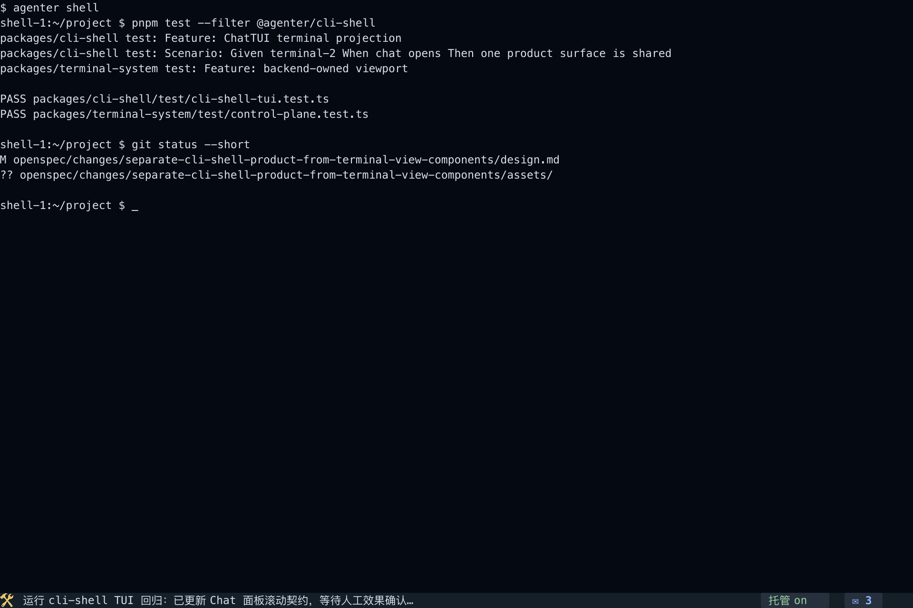
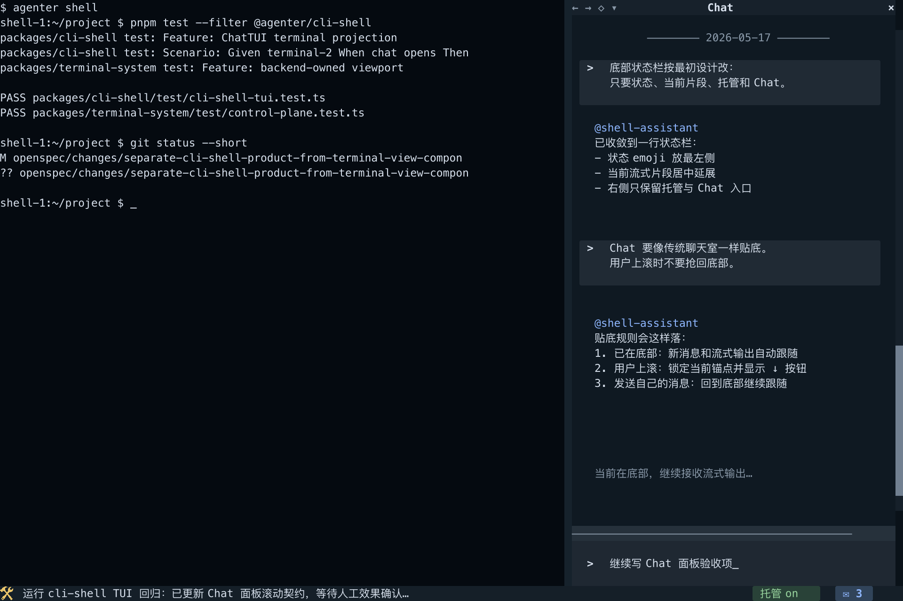
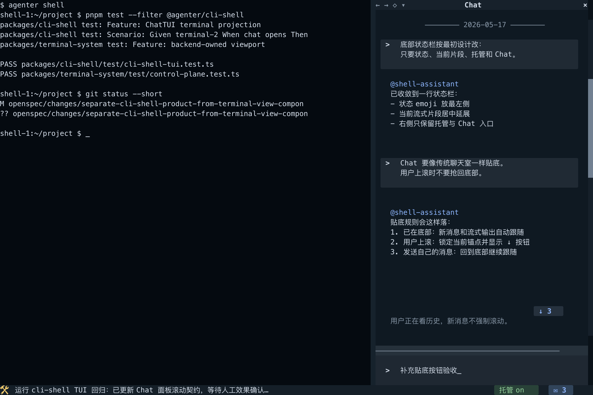

> Superseded note:
> This design preserves historical analysis and acceptance evidence, but its architecture still depends on the older `terminal-1` / `terminal-2` cli-shell worldview.
> Current implementation or spec work must follow `realign-cli-shell-with-core-system-boundaries` instead of replaying this design.

## Context

`add-cli-shell-product` already established `@agenter/cli-shell` as an external product package. `promote-ghostty-native-cli-shell` already established `--backend=<name>` and the one-line markdown bottom-rendering law. The unresolved problem is no longer command grammar. It is that the current shell-first draft still mixes product terminology and component terminology.

The durable split now needs to be:

1. backend terminal truth
2. raw terminal transport as the substrate
3. derived screen-projection/composition on top of that substrate
4. platform components: `web-terminal-view` and `shell-terminal-view`
5. product composition: `cli-shell`

The old ambiguous host term is actively harmful because it hides whether a statement is about a reusable component or about the product. That confusion keeps inviting a second frontend-owned terminal truth, which is the wrong law for a real shell product.

This change therefore plays a narrow but important role in the overall history:

- `add-cli-shell-product` already defined the product target and even shipped accepted reference images
- `promote-ghostty-native-cli-shell` is already complete in the current workspace and already defines `--backend=<name>` plus the one-line markdown bottom projection law
- `promote-ghostty-native-terminal-backend` is already complete in the current workspace and already closes the remaining `app-server` backend projection gap
- later acceptance found that the shipped implementation could not reliably satisfy that target
- this change exists to repair the missing platform law before `add-cli-shell-product` can honestly be considered complete in practice

## Current Visual Target

This corrective change supersedes the archived v8 review images with the v9 ChatTUI references below. The v8 terminal-grid direction remains the ancestor, but the bottom status row and Chat scroll behavior are updated from the user's latest effect feedback.

Collapsed shell-first state:

Chat panel open, pinned at bottom:

Chat panel open, user scrolled upward:

Paired source and terminal-grid auxiliary references:

- `assets/cli-shell-chat-tui-reference-v9-toolbar-grid.svg`
- `assets/cli-shell-chat-tui-reference-v9-toolbar-grid.txt`
- `assets/cli-shell-chat-tui-reference-v9-chat-right-pinned-grid.svg`
- `assets/cli-shell-chat-tui-reference-v9-chat-right-pinned-grid.txt`
- `assets/cli-shell-chat-tui-reference-v9-chat-right-scrolled-grid.svg`
- `assets/cli-shell-chat-tui-reference-v9-chat-right-scrolled-grid.txt`
- `assets/generate-chat-tui-references.ts`

These files are the current effect-confirmation target for future apply work. The PNGs are review images, the SVG/TXT files are inspection companions, and the generator is the deterministic source for regenerating the set.

## Why This Architecture

The opening architectural claim of this change is simple:

- if a human sees one shell
- if the system commits one shell history
- if LoopBus understands one shell

then those three paths must come from one backend terminal truth.

Anything else is a projection bug disguised as architecture.

The second architectural claim is boundary discipline:

- `web-terminal-view` and `shell-terminal-view` are components
- `cli-shell` is a product

If those roles are not separated in the change itself, the implementation will keep drifting back toward product-specific component laws or component-specific product hacks.

This is also why the current move is a corrective supplement rather than a redesign from scratch. The product target from `add-cli-shell-product` is still valid. What failed was the system's ability to uphold that target under real acceptance pressure.

## Goals / Non-Goals

**Goals:**

- Replace the old ambiguous host term with precise product/component vocabulary.
- Keep backend terminal truth as the only authoritative source for render, durable change log, and terminal observation.
- Keep runtime-owned product resource binding actor truth aligned to the session runtime identity rather than avatar catalog metadata.
- Make same-terminal attachments share viewport and visible input truth.
- Define `web-terminal-view` as a reusable Web component, not a debugging-only artifact.
- Define `shell-terminal-view` as the native terminal component that `cli-shell` uses as its primary shell surface.
- Separate backend geometry authority from host-local presentation scaling.
- Make product actions and terminal scroll affordances truth-bound: buttons and shortcuts must hit explicit product action contracts, while pointer or wheel scroll must hit backend viewport mutation truth instead of host-local replay.
- Separate product action semantics from native shortcut delivery semantics so `cli-shell` does not confuse "this action exists" with "this host actually delivered the configured modifier chord".

**Non-Goals:**

- Do not redesign backend selection; `--backend` stays governed by existing changes.
- Do not reopen the one-line markdown bottom projection law; bottom rendering still follows the existing `MarkdownRenderable` plus last-visual-line rule.
- Do not redesign `agenter shell --web`; this change only preserves that future products can reuse `web-terminal-view`.
- Do not let `cli-shell` import core runtime internals or add cli-shell-only branches to core.
- Do not define every renderer-specific canvas implementation detail in this change.
- Do not introduce an independent-view exception for same-terminal attachments inside this change; if a future product wants an independent viewport, it must use a separate terminal truth or a separate explicit contract.
- Do not force a package rename or a standalone native projection package in this change; role separation must become explicit in contracts, tests, and product composition first.
- Do not treat `tmux`, `cmux`, or another terminal multiplexer as equivalent to the native terminal program for final `cli-shell` acceptance. Those hosts can help debug, but they are not the authoritative acceptance environment for native shell-window geometry or native interaction truth.
- Do not assume one modifier interpretation such as `meta` is universally equivalent to native Command delivery. Host-delivered shortcut truth must be verified in the owning native terminal program.

## What Still Counts As A Real Shell

This change does not reject the architecture direction "backend performs headless terminal rendering, projection hosts render that backend truth back to native/Web surfaces". That direction still counts as a real shell product when all of the following hold:

- the backend terminal remains the only PTY, buffer, scrollback, cursor, viewport, and geometry authority
- projection hosts only render backend truth and send explicit input, resize, or viewport mutation requests back to backend authority
- visible output, durable terminal commits, and LoopBus observation all derive from that same backend truth

The architecture stops counting as one real shell when a projection host starts owning any second buffer, second scrollback law, second viewport law, or split-fidelity history model for the same terminal truth.

For this change's stronger target law, the same rejection applies to accepted product chrome. If terminal-2 is declared as the final product terminal, then any accepted one-line bottom chrome or transcript-open state that belongs to that final product surface must also live in terminal-2 truth. A host-local toolbar or dialogue layer that Web attachments to terminal-2 cannot observe is still a second product-surface truth.

## Layered Model

### 1. Backend terminal truth

The backend terminal owns:

- renderable cells and styles
- cursor state
- scrollback state
- viewport state
- durable terminal change-log truth
- LoopBus / attention terminal observation truth
- terminal geometry truth

Clients and products may cache or scale projections of that truth, but they do not get to create a second authoritative terminal state machine.

### 2. Runtime-owned actor truth

Products may select avatars through a global catalog, but runtime-owned terminal and room bindings still belong to the created or reused session runtime actor.

For this corrective change:

- terminal grants for `cli-shell` product-owned terminals derive actor truth from the session runtime
- room grants for product rooms derive actor truth from the same session runtime
- runtime-visible focus must land through session-owned runtime focus planes for terminals and rooms
- products that need actor identity later for delegation, unread projection, or attribution must carry forward session actor truth instead of re-deriving from catalog metadata

### 3. Canonical terminal transport and edge raw adapters

The canonical contract between backend truth and projection views must carry:

- bootstrap snapshot truth
- live terminal output truth
- shared viewport truth
- geometry authority truth
- presentation-ready and local metrics as projection metadata, not backend ownership

This canonical contract is the multi-view synchronization substrate. Projection and composition are derived uses of it, not a second independent transport tree.

Raw ANSI/VT transport still exists, but only as an edge adapter where the boundary itself natively speaks terminal bytes, such as:

- the shell PTY boundary owned by backend terminal truth
- a renderer or host boundary that only accepts terminal byte streams

That raw adapter is not a second frontend-owned truth and not the durable replication substrate between backend truth and multiple attachments.

### 4. `web-terminal-view`

`web-terminal-view` is the reusable Web-platform terminal projection component. It is not a debugging-only surface. WebUI may embed it, and future products such as `agenter shell --web` may embed it too.

`web-terminal-view` may:

- decode and render the raw terminal transport through the browser-facing renderer stack
- scale, fit, cover, zoom, or frame backend geometry for Web presentation
- manage renderer-local lifecycle and DOM concerns
- expose host-local presentation controls

`web-terminal-view` may not:

- invent terminal buffer truth
- invent viewport truth for a shared terminal attachment
- silently replace backend geometry authority when another host already owns it

### 5. `shell-terminal-view`

`shell-terminal-view` is the native terminal-platform projection component. It decodes and renders backend-authored terminal truth back into the user’s terminal as terminal-cell content rather than Web DOM or canvas content.

When used inside `cli-shell`, `shell-terminal-view` is the default geometry authority for the attached terminal because it is bound to the native shell window after subtracting reserved product rows. It also needs one continuous renderer surface: it must not split one terminal into a rich live strip plus a plain-text historical mirror. For the accepted final law in this change, `shell-terminal-view` decodes terminal-2 as the complete final product-terminal surface instead of adding accepted bottom/dialogue chrome as a second host-owned truth.

For this change, `shell-terminal-view` is primarily a contract and component-role name, not a mandatory standalone package split. The first repaired implementation may keep the native projection module inside `packages/cli-shell` as long as the boundary is explicit enough that product composition and projection behavior are distinguishable in code and reusable in principle.

### 6. `cli-shell`

`cli-shell` is the product. It composes:

- one attached visible product terminal plus one attached shell-truth terminal under the same product session law
- one `shell-terminal-view`
- one one-line bottom extension
- one room / Avatar / LoopBus integration surface

The product law remains shell-first: the shell owns the main surface, while the bottom extension remains orthogonal chrome.

For this repaired architecture, attached terminal truth is literal product truth. A `cli-shell` instance binds its main shell surface to the visible product-terminal resource returned by bootstrap or reconnect, not to a later runtime focus projection such as `focusedTerminalId`. Session focus still matters for observation and generic runtime behavior, but it does not get to silently swap the shell body onto a different terminal truth after attach.

The stronger corrective target in this change is that terminal-2 itself owns the complete backend-authored final product surface. That means the accepted one-line bottom chrome and any accepted transcript-open state belong to terminal-2 truth so that native and Web hosts observe the same product state from the same terminal. Native host composition may still supply container, focus, and pointer primitives, but it does not get to keep a second accepted product-chrome truth outside terminal-2. In this target law, terminal-1 to terminal-2 projection belongs to a protocol-2 composition pipeline, while `shell-terminal-view` is the native decoder/renderer that displays terminal-2 truth in the owning shell host.

### 6.5 Initial code-evidence gap that motivated the repair

At proposal time, code audit showed the workspace had not yet reached the stronger law above:

- `packages/cli-shell/src/bootstrap.ts` still bound `visibleTerminal` to a projection path from terminal-1 shell truth
- `packages/terminal-system/src/projection-terminal-runtime.ts` remained a source-terminal passthrough runtime and did not own accepted product chrome
- native host composition was still carrying accepted bottom/dialogue chrome outside backend-owned terminal-2 truth
- `packages/cli-shell/src/web/start-cli-shell-web-host.ts` already attached directly to terminal-2 transport, which made the terminal-2 publication gap immediately visible in Web host behavior

That earlier gap is what justified keeping terminal-2 final product truth as an explicit blocker in tasks and acceptance.

### 6.75 Recommended repair path for terminal-2 final product truth

The repair path adopted in code is:

1. keep terminal-1 as the only shell PTY/buffer/scrollback/cursor/viewport authority
2. introduce an explicit protocol-2 composition stage that consumes terminal-1 snapshot truth plus accepted product chrome state
3. publish the composed result into terminal-2 as backend-owned final product-terminal truth
4. make native `shell-terminal-view` decode/render terminal-2 instead of adding accepted bottom/dialogue chrome as a second host-local truth
5. keep Web host attached to terminal-2 so it naturally observes the same final product surface

That path preserves the user's original 8-point direction while minimizing architectural drift:

- raw protocol remains the substrate
- protocol-2 remains derived from that substrate
- Web still does not need its own protocol-2 decoder to satisfy `cli-shell --web`
- native host still gets to use OpenTUI primitives for focus, pointer ownership, and geometry, but not for a second accepted product-surface truth

The resulting code movement for this repair path is:

- terminal-1 snapshot and shared viewport truth remain where they were
- accepted bottom heartbeat/actions and accepted transcript-open product state move out of native-host-local paint-only state and into a backend composition model
- terminal-2 publication becomes the composed output of that model
- native and Web hosts both decode/render terminal-2 for accepted product-surface state

The runtime seam implemented for that path is:

- keep `packages/terminal-system/src/projection-terminal-runtime.ts` semantically narrow as a source-terminal passthrough runtime
- add a distinct backend-authored composed runtime for terminal-2 final product truth instead of teaching projection passthrough to invent accepted product chrome
- let `packages/terminal-system/src/terminal-control-plane.ts` choose that composed runtime through explicit terminal metadata, separate from `projectionSourceTerminalId`
- keep terminal-1 as the only PTY-owning runtime; terminal-2 composed runtime owns snapshot/status/lifecycle publication for the final product surface without pretending to be a second shell process
- emit terminal-2 composed snapshots through the existing `TerminalRuntime.onSnapshot(...)` / `onStatus(...)` seam so terminal transport, `readGlobalTerminal(...)`, session-runtime terminal observation, and LoopBus all continue to consume one standard terminal publication path

Current code evidence also argues against centering this repair on `publishSnapshot?` as the primary platform seam:

- `packages/terminal-system/src/managed-terminal.ts` declares `publishSnapshot?`, but current workspace code does not yet use it as a durable control-plane publication API
- `packages/terminal-system/src/terminal-control-plane.ts` already has a stronger, better-integrated seam: runtime selection plus generic snapshot/status listeners
- `packages/app-server/src/session-runtime.ts` already marks terminal observation dirtiness from generic terminal snapshot changes rather than from a special cli-shell publication path

So the implemented direction is not "push host frames into a managed terminal from the outside". It is "introduce a first-class backend runtime whose ordinary snapshot truth is already the composed terminal-2 product surface".

What this path deliberately does not require:

- Web implementation of a second independent protocol tree
- abandonment of the headless-backend projection direction
- a second shell PTY
- a host-local replay model being promoted to truth
- mutation of `ProjectionTerminalRuntime` into a mixed passthrough-plus-product-composer runtime

### 6.8 Initial geometry-arbitration gap that motivated the repair

At proposal time, code evidence showed the workspace still fell short of the user's multi-frontend geometry-authority requirement:

- `TerminalHello` did not yet carry an ordering field such as `geometry-order`
- transport bootstrap did not yet roundtrip backend-resolved authority facts
- control-plane attachment state did not yet model authority arbitration as a first-class backend fact
- the Web host still needed an adapter path that projected browser claims onto shared backend authority truth

That earlier gap is what justified keeping geometry authority as a first-class backend law in this change.

The repair direction implemented in code is:

1. extend the shared transport/control-plane attachment contract with enough facts to arbitrate authority in backend truth, including `geometryRole`, optional `geometry-order`, and stable attachment identity
2. let backend control-plane persist attachment creation order plus renewable liveness/lease facts and resolve the active authority there
3. expose the resolved authority winner and projection-only attachments through backend-facing evidence or inspection seams
4. if `cli-shell --web` keeps claim/release endpoints for UX reasons, make them adapters over shared backend authority truth rather than a second independent authority system

That backend law now exists in the implementation and focused automated tests. The remaining incomplete work is final native-host acceptance evidence, not geometry-arbitration implementation.

## Decisions

### 1. The old ambiguous host term is removed from the durable vocabulary

All new contract language will distinguish:

- `web-terminal-view`: Web component
- `shell-terminal-view`: native terminal component
- `cli-shell`: product

Rationale:

- This is the smallest durable vocabulary that matches the architecture the user defined.
- It keeps component contracts reusable and product contracts product-specific.

Rejected alternative:

- Keep one ambiguous host shortcut term.
  - Rejected because it collapses product and component boundaries again.

### 2. Single source of truth includes render, durable change log, and observation

The backend terminal is the only authoritative source for:

- rendered cells, styles, and cursor
- viewport and scrollback
- durable terminal change log
- LoopBus observation ingress

Rationale:

- The shell the user sees, the terminal facts the system commits, and the terminal facts LoopBus understands must not diverge.
- A frontend-owned replay or plain-text mirror is only a projection and cannot be promoted to truth.

Rejected alternative:

- Allow a frontend-local terminal state machine as long as it "looks close enough".
  - Rejected because the durable commit path and LoopBus observation path would still be able to disagree with the visible shell.

### 3. Runtime-owned product bindings use session actor truth

For runtime-owned terminal and room bindings, product-extension runtime derives grant actor ids, focus operations, and later attribution truth from the created or reused session runtime actor identity rather than from global avatar catalog metadata alone.

Rationale:

- real daemon sessions may run under a principal different from the catalog row used for avatar selection
- if grants or focus target the catalog principal instead of the session actor, the shell can appear attached while the runtime cannot observe, focus, or attribute the same resources

Rejected alternative:

- Treat catalog principal as binding truth once nickname resolution succeeds.
  - Rejected because avatar selection metadata and runtime actor truth are different planes.

Implementation note:

- runtime-owned binding input should carry the session or equivalent runtime actor truth
- terminal focus should land through session-owned runtime terminal focus APIs
- room focus should land through session-owned runtime message-channel focus APIs
- product bootstrap outputs may preserve session actor truth for later delegation, unread projection, or attribution

### 3.25 One product session key derives two terminal binding identities

`cli-shell` keeps `shell-1` as the durable product session key, but it does not reuse that same terminal binding identity for both backend terminal roles. Instead it derives stable terminal binding resource keys `shell-1:terminal-1` and `shell-1:terminal-2`.

The room binding keeps `shell-1` because the room is the product session conversation surface, not one of the two terminal roles.

Rationale:

- the current product-extension-runtime binding law already keys bindings by `productId + resourceKey + ownerSystem`
- deriving two product-local terminal resource keys preserves the existing platform contract without inventing a cli-shell-only backend abstraction
- the current bug exists precisely because one session key was reused as one terminal binding identity and the two roles collapsed in lookup and attach paths

Rejected alternatives:

- Extend generic binding metadata immediately with a `terminalRole` dimension.
  - Rejected because the current evidence only proves a cli-shell product need, and derived keys already satisfy the architecture without polluting the platform law.
- Reuse `shell-1` for both terminal bindings and infer roles from side metadata.
  - Rejected because lookup by binding metadata can collapse the two roles back into one terminal and recreate the current architecture bug.

Implementation note:

- bootstrap must ensure both terminal bindings explicitly and return both terminal ids
- native and Web product surfaces must bind to `terminal-2`
- managed terminal authority, durable shell commit source, and LoopBus readiness must continue to derive from `terminal-1`

### 3.5 Product shell binding follows the attached terminal resource

`cli-shell` binds its shell surface to the terminal resource returned by bootstrap or reconnect, not to the current value of `runtime.focusedTerminalId` or another focus projection.

Rationale:

- one session may legitimately retain focus facts for multiple terminals
- a reused runtime can still report an older focused terminal while a new `cli-shell` instance attaches a different terminal resource
- if the product shell body follows focus projection instead of attach truth, the visible shell can drift onto the wrong backend terminal even though grants, room wiring, and terminal transport are otherwise correct

Rejected alternative:

- Treat session focus projection as sufficient shell-binding truth.
  - Rejected because focus is a runtime projection plane, not the product's attached terminal identity.

Implementation note:

- bootstrap outputs must preserve the attached terminal id explicitly
- `shell-terminal-view` model construction must prefer that attached terminal id over generic runtime focus projections
- reconnect behavior may use focus planes for observation or unread semantics without letting them redefine the product-owned shell surface

### 4. Same-terminal attachments share visible viewport truth

If several `web-terminal-view` or `shell-terminal-view` instances attach to the same backend terminal truth, they share:

- buffer content
- viewport position
- visible input effects

A scroll in one shared attachment changes the shared viewport for the others. Input in one shared attachment becomes visible in the others through the same backend terminal truth.

Rationale:

- The user explicitly defined "single source of truth" to include visible scroll and visible input behavior, not only scrollback bytes.

Rejected alternative:

- Share buffer content but let every client keep an independent viewport.
  - Rejected because it produces multiple visible truths for one terminal.

Implementation note:

- the missing platform gap is not only in component code; transport and runtime publications must expose explicit shared viewport mutations so this truth is observable and synchronizable across attachments
- the preferred repair path is: attachment emits an explicit viewport mutation request -> runtime applies it against backend terminal truth -> runtime republishes the resulting viewport through authoritative terminal snapshot/state publication
- do not introduce a second client-side viewport acknowledgment state machine just to synchronize attachments; the backend-updated viewport remains the only visible-truth echo path

### 5. Geometry authority is separate from presentation scaling

A terminal id has one backend geometry truth at a time. Host components may present that grid differently, but presentation scaling is not the same thing as terminal geometry authority.

For the shell-first product:

- `shell-terminal-view` owns terminal-2 final product-surface geometry from the native shell window's full visible size.
- `cli-shell` derives terminal-1 shell-truth geometry from that terminal-2 product-surface geometry by subtracting reserved product rows and any docked transcript columns that belong to the accepted final product surface.
- `web-terminal-view` may scale, fit, or cover that geometry, but it does not silently resize the backend terminal while `cli-shell` is the geometry authority.

Rationale:

- This preserves the native-shell contract without turning `web-terminal-view` into a debugging-only dead end.
- It also keeps future Web products reusable: they can present the grid differently without hijacking the shell’s terminal truth.

Rejected alternative:

- Every host that resizes locally also rewrites backend geometry.
  - Rejected because a shared terminal would constantly oscillate between host-specific sizes and stop behaving like one shell.

Implementation note:

- the shared attachment contract should make resize role explicit, for example `authoritative` versus `projection-only`, so `web-terminal-view` can safely fit/cover/zoom without silently rewriting backend cols and rows while `cli-shell` still owns geometry
- authority transfer, if it ever exists, must be an explicit runtime/control-plane fact rather than an accidental side effect of whichever host resized last

### 5.5 Geometry arbitration must be deterministic across multiple attachments

Multiple frontends may attach to the same backend terminal truth, and more than one attachment may be technically capable of resizing it. That does not mean geometry ownership may fall back to "whoever resized last".

For the durable law in this change:

- every attachment declares one geometry role: `authority` or `projection-only`
- authority-capable attachments may also declare an optional explicit `geometry-order`
- lower `geometry-order` wins over higher `geometry-order`
- if no explicit order is declared, runtime falls back to attachment creation order for attachments with the same role
- active authority is held by a renewable lease or equivalent liveness fact, so disconnect or expiry reopens arbitration deterministically
- `projection-only` attachments never participate in resize arbitration until their role changes explicitly

Recommended product-facing naming:

- CLI flag / config: `--geometry-order=<int>`
- lower number means higher priority
- no boolean `--master` shortcut in the durable contract

Rationale:

- the user explicitly wants one backend that may serve multiple frontends
- connection order alone is useful as a fallback, but it is not enough for explicit takeover or operator intent
- boolean `master` creates an avoidable singularity and loses ordering information the moment two hosts both want authority

Rejected alternative:

- Let every authority-capable attachment race on local resize timing.
  - Rejected because it collapses back into last-resizer-wins and makes backend geometry nondeterministic.

Implementation note:

- the current transport/control-plane contract already carries `geometryRole`, but it still needs a separate ordering/arbitration field plus lease-aware resolution semantics
- authority reevaluation should happen on attachment connect, disconnect, lease expiry, and explicit role/order change
- accepted evidence must name which attachment won authority, by which explicit order or fallback order, and why the competing attachment stayed projection-only

### 6. `shell-terminal-view` must remain one continuous renderer surface

`shell-terminal-view` must project one continuous terminal surface. It must not degrade older scrollback rows into a second plain-text region while lower rows remain colorized and renderer-native.

Rationale:

- A split rich/plain-text surface is visible evidence that the system created a second projection law instead of projecting one backend truth.
- This also breaks operator expectations for color, cursor position, and scroll continuity.

Rejected alternative:

- Keep a rich "live" renderer for recent rows and a cheaper plain-text mirror for committed history.
  - Rejected because it turns one terminal into two inconsistent projections.

### 7. Native terminal projection must not reflow backend terminal truth through host text layout

`shell-terminal-view` may use native terminal UI primitives for composition, focus, pointer regions, or chrome, but it must not hand backend terminal rows back to a host text-flow renderer that can re-wrap, re-measure, or restyle them as ordinary prose. The backend terminal truth must stay in a cell-locked projection pipeline all the way to the visible native shell surface.

Rationale:

- A terminal row is not ordinary text content. If the native host reflows projected rows through generic text layout, the host silently becomes a second rendering law.
- This is the direct failure shape behind cursor drift, long-line corruption, color discontinuity, and scrollback fragmentation.

Rejected alternative:

- Allow `shell-terminal-view` to project backend rows into generic host text nodes as long as the result usually looks correct.
  - Rejected because "usually looks correct" still permits host-local wrapping, width drift, and style fragmentation that violate single-terminal truth.

Implementation note:

- native composition may still use OpenTUI primitives such as `Box`, pointer regions, or other chrome surfaces
- for this repaired native implementation, any visible shell scrollbar should be the existing OpenTUI scrollbar primitive itself, remain only a projection of backend viewport truth, and must not be replaced by host-local overlay hitboxes, bespoke simulated text scrollbars, or any separately painted shell glyph track
- if that OpenTUI scrollbar exposes thumb drag, track/page activation, or pointer-wheel integration, every such interaction still resolves through the same backend viewport-mutation path and is confirmed only by authoritative viewport republish
- the repaired implementation should prefer a framebuffer or cell-grid style projection path over host text-flow composition for the shell body

### 7.5 Host interaction primitives are control projections, not a second visible truth

When `terminal-2` is the backend-owned final product-terminal surface, the native host may still use explicit host primitives such as OpenTUI `scrollbar`, focusable `Box`, `Input`, or equally explicit native controls to own click, focus, and scroll gestures. Those primitives remain lawful only as control projections. They do not get to become a second visible product truth.

For this change, "control projection" means:

- the primitive may decide which product action or viewport mutation request to send
- the primitive may own native focus and pointer transfer semantics for the local host
- the primitive may expose host-local affordance geometry for that action path
- the primitive does not become the durable source of the resulting visible product state

The visible result remains valid only after backend-owned truth changes and is republished through `terminal-2`.

Rationale:

- native and Web hosts need lawful host-specific interaction primitives, but they still must converge on one observed product surface
- if a local click opens transcript chrome, toggles managed state, or changes placement without that result becoming observable from terminal-2, the native host still owns a second product truth
- keeping control ownership and visible-state ownership separate lets the current stack reuse OpenTUI primitives without forcing terminal-2 to masquerade as an HTML-like button tree

Rejected alternative:

- Require terminal-2 composed surface to carry a full host-agnostic widget tree before any host may expose lawful interaction.
  - Rejected because the current architecture only needs one backend-owned visible surface plus explicit host control ownership. Forcing a second semantic UI tree here would over-model the product and delay the actual single-truth repair.
- Allow host-local interaction primitives to directly own the accepted visible result as long as they call the same controller logic.
  - Rejected because shared controller code does not prevent native and Web hosts from observing different visible product states.

Implementation note:

- accepted product actions such as managed toggle, transcript open, transcript close, placement changes, send, and viewport mutation may originate from host primitives, but the resulting visible state must be observable from the next terminal-2 publication
- host-local labels, focus rings, or hit targets may exist as native affordances, but accepted bottom chrome, transcript-open state, placement state, and visible shell viewport state must still resolve back to terminal-2 truth
- for the current stack, terminal-2 composed publication may stay screen-first plus explicit product-state fields; this change does not require a separate backend widget tree as long as native-visible product state no longer lives only in host-local composition
- any native-only affordance that cannot be observed from concurrent terminal-2 attachments remains non-compliant even if the action handler itself is shared

### 8. Cursor ownership follows explicit focus ownership

The visible cursor owner inside `cli-shell` must be determined by explicit native focus ownership. When `shell-terminal-view` owns focus, the visible cursor belongs to the backend terminal projection. When a transcript entry or other product input box owns focus, that product input surface owns the visible cursor instead.

Rationale:

- Cursor visibility is part of terminal truth only while terminal input owns focus.
- The product already needs explicit interaction-mode boundaries, so cursor ownership should follow that same focus truth instead of local heuristics.
- Only one visible cursor owner may exist at a time; dual cursor ownership is a visible contradiction between shell truth and product-input truth.

Rejected alternative:

- Infer cursor ownership from whichever surface last handled a key event without an explicit focus model.
  - Rejected because the shell and product chrome can drift into contradictory cursor states under clicks, shortcuts, and transient overlays.

Implementation note:

- for this repaired native implementation, OpenTUI focusable `Box`, `Input`, and focused-renderable primitives are the expected source of native focus truth; requested-focus intent, last-key heuristics, or separately simulated cursor-owner state are out of bounds if they disagree with the actual focused renderable tree
- click or pointer transfer between focusable shell and transcript/product-input boxes must update that same OpenTUI focus truth, so visible cursor ownership follows Box/input focus movement rather than an independent local toggle
- the host focus primitive only determines which projection surface currently owns the cursor; it does not invent a second cursor state for the terminal itself

### 9. The bottom extension remains orthogonal product chrome

The bottom extension stays exactly one rendered line in collapsed mode. Its information architecture is fixed as:

1. status icon
2. current streaming activity part
3. managed/takeover toggle
4. Chat entry with unread count

It must not print the literal label "Heartbeat", must not show visible shortcut instructions in the row, and must not expand into backend status chips. The current streaming activity part is still sourced from the latest Heartbeat/message-part truth, but the UI text should read like a live terminal status fragment rather than a labelled dashboard field. Built-in `message`, `terminal`, and `attention` tool activity should be summarized for terminal scanning instead of dumping raw payloads.

The bottom extension does not own terminal scrolling, cursor semantics, or lifecycle truth.

Rationale:

- `cli-shell` is a shell product with an extension line, not a dashboard that happens to contain a terminal.

### 9.5 Chat panel is a traditional pinned chat room

The explicit Chat panel is the product room surface. It remains optional chrome over the shell-first product and follows traditional chat-room scroll semantics:

- if the transcript is pinned at the bottom, new messages and streaming message-parts keep the visible list at the bottom
- if the user scrolls upward, the panel preserves the user's current scroll anchor and does not force-scroll on new output
- while not pinned at the bottom, the panel shows a compact stick-to-bottom / new-message button
- clicking that button, pressing the equivalent product action, or sending the user's own message returns the panel to bottom-pinned mode
- the panel always owns a visible scrollbar column for its message list; the scrollbar reflects chat transcript position, not shell viewport position

The Chat panel can use docked right/left/bottom or full-panel-cover/floating placement according to available space. Non-bottom placements must still expose a stick-to-bottom control whenever the transcript is not pinned. The old "temporary floating layer" idea is not required as a visual form; when space is insufficient, full panel cover is valid because the panel exists specifically for constrained terminal space.

Visual discipline:

- The panel is frameless in docked modes: use background, color, whitespace, one split line, gutters, and a scrollbar column rather than a full enclosing border.
- The top toolbar owns placement actions on the left and close on the right.
- The message list renders Markdown in terminal cells.
- User messages use a muted background and the left gutter `>` marker.
- The bottom input uses a muted background, a top divider line, the left gutter `>` marker, multiline-capable input, and a visible cursor when focused.

Rationale:

- Chat is a conversation surface, so its scroll behavior should match ordinary chat tools rather than terminal scrollback.
- Separating chat transcript scroll from shell viewport scroll keeps the two terminal truths orthogonal.

### 10. Visible Avatar startup means active LoopBus terminal observation

The product-visible meaning of "Avatar started" is that terminal changes from terminal-1 shell truth are already eligible to wake LoopBus and participate in understanding flow.

Rationale:

- Process bootstrap or heartbeat text is only a projection. The user asked for a stronger readiness signal: observation must actually be live.

### 11. Product action semantics are separate from native shortcut delivery semantics

`cli-shell` owns product action semantics such as transcript open, transcript close, placement changes, send, and managed toggle. The owning native terminal program owns which key chords are actually delivered to the product and which modifier bits those chords arrive with. The repaired architecture therefore must not treat one hard-coded modifier interpretation as equivalent to native truth.

Rationale:

- controller and view-model tests can prove that a product action exists without proving that the real native host ever delivered the configured shortcut
- real native terminal programs may distinguish `meta`, `super`, and `option` differently from local mocks or from other hosts
- acceptance already exposed this exact gap: local tests stayed green while real native shortcut paths remained partially unreachable

Rejected alternative:

- Treat a passing controller shortcut test as sufficient proof that the native host delivered the same shortcut.
  - Rejected because that collapses product semantics and host-delivery truth into one false layer.

Implementation note:

- product shortcut config should name product actions first and allow host-delivery truth to map onto them
- matching logic must not assume `meta` is the only lawful native Command projection
- for the current native `cli-shell` stack, visible product actions should be owned by OpenTUI focusable/clickable primitives such as buttons, inputs, or equally explicit host primitives instead of by transparent overlay hotspots or plain text mouse-handler labels that bypass component ownership
- final native acceptance must record which modifier truth the owning host actually delivered for the tested actions
- if the owning host blocks a configured shortcut entirely, acceptance must record that host fact and still prove the same product action through click or a host-lawful override path instead of silently downgrading the product action requirement

## Risks / Trade-offs

- [Shared viewport truth reduces per-client independence] -> Mitigation: independent viewing requires a separate terminal truth or a future explicit fork/mirror contract, not an implicit same-terminal exception.
- [Geometry authority owned by `cli-shell` may surprise Web hosts] -> Mitigation: publish geometry authority explicitly and keep Web resizing as presentation scaling unless authority changes intentionally.
- [Global avatar catalog identity can diverge from session runtime actor truth] -> Mitigation: bind runtime-owned terminal/room resources from session truth and verify with a real-daemon mismatch regression.
- [Native terminal interaction routing is stricter than ordinary Web event handling] -> Mitigation: make shell-input versus product-action routing explicit in component and product contracts instead of relying on ad-hoc local state.
- [Native shortcut tests can pass while real host modifiers differ] -> Mitigation: model product actions separately from host-delivered shortcut profiles and require native evidence for delivered modifier truth.
- [Continuous renderer fidelity may cost more than a cheap scrollback mirror] -> Mitigation: optimize inside one projection pipeline rather than splitting truth across two surfaces.

## Acceptance End State

The closing acceptance target for this change is the following observable end state:

1. Product identity is clear
   - `cli-shell` reads and behaves like a real shell product
   - `web-terminal-view` reads and behaves like a reusable Web component
   - `shell-terminal-view` reads and behaves like a reusable native-terminal component

2. One shell means one truth
   - what the operator sees
   - what the terminal change log commits
   - what LoopBus observes
     all come from the same backend terminal source
   - the terminal and room grants/focus that make those facts visible align to the same session runtime actor truth

3. Same terminal means same visible world
   - if one attachment scrolls, the other attachment scrolls
   - if one attachment types, the other attachment can visibly observe the result
   - if one attachment still shows color, the other attachment must not degrade the same terminal into a plain-text split surface
   - if a visible scrollbar exists, it is only a projection of backend viewport truth rather than a host-local scroll owner
   - if the operator sends a room message from transcript chrome, the draft clears but transcript chrome does not auto-close
   - if the operator runs `ls` and then repeated blank `Enter`, older rows do not fall back to a weaker plain-text or uncolored tier

4. Shell-first product chrome is preserved
   - the bottom extension is exactly one rendered line in collapsed mode
   - product actions remain interactive through native pointer/click or shortcut paths
   - visible product affordances are owned by explicit OpenTUI/native primitives rather than by transparent overlay hitboxes or plain text mouse-handler chrome
   - shortcut-based product actions are verified against the actual modifier truth delivered by the owning native host, not only against mocked `meta` key events
   - if a host blocks one configured shortcut, the acceptance record names that host fact and still proves the same product action through another lawful native interaction path
   - shell scroll gestures mutate shared viewport truth rather than a native-local mirror
   - shell-terminal cursor visibility belongs to the focused shell projection, while transcript or product input cursor visibility belongs to the explicitly focused product input box
   - only one surface presents itself as the active visible cursor owner at a time
   - transcript chrome remains optional extension chrome rather than stealing bottom ownership

5. Startup truth is real
   - "Avatar started" is only shown after terminal changes are actually eligible to wake LoopBus observation flow

This end state is not the final stop by itself. It is the architecture gate that must pass before the archived `add-cli-shell-product` delivery can be re-accepted.

The required close-out sequence is:

1. finish this corrective architecture change
2. reopen the affected `add-cli-shell-product` obligations in implementation tracking
3. re-check the archived product promises against the repaired architecture
4. rerun product acceptance for the original shell product effect

The minimum reopen mapping is:

- archived `add-cli-shell-product` `3.2`: terminal grant and focus must target the actual summoned runtime actor rather than a catalog identity lookup
- archived `3.5`: room grant and focus must target the same runtime actor truth through the message-system authority plane
- archived `3.6`: repeated launch and attach must still hold when avatar catalog principal and session runtime principal differ
- archived `add-cli-shell-product` `4.7`: toolbar action buttons must be truly interactive rather than only rendered
- archived `4.13`: terminal-mode input routing must hold under the repaired projection architecture
- archived `4.14`: dialogue and product actions must not leak into backend shell input
- archived `4.15`: shell-terminal resize handling must respect explicit geometry authority
- archived `4.17`: product chrome must still render as one continuous terminal-cell surface rather than split fidelity tiers
- archived `4.22`: the focused TUI/view-model assertions for terminal hydration, input routing, resize geometry, and action behavior must be revalidated against the repaired architecture
- archived `5.5`: the real local walkthrough must be rerun because the original acceptance claim was invalidated by later failures

## Acceptance Evidence

Apply-ready execution for this change should produce one objective evidence pack with these parts:

1. Opening architecture evidence
   - file/path evidence showing backend truth, component projection, and product composition are separate layers
   - explicit note of the session actor truth path used for runtime-owned terminal/room binding
   - explicit note of which focus APIs carry runtime-owned terminal and room focus
   - explicit note of which module owns geometry authority
   - explicit note of which modules are projection-only

2. Native product evidence
   - one real `cli-shell` walkthrough record showing collapsed one-line bottom chrome
   - one record showing managed, transcript-open, placement, close, and send actions activate through native pointer/click or shortcut paths without leaking into backend shell input
   - one explicit note naming which OpenTUI/native primitive actually owned each accepted managed, transcript-open, placement, close, and send path
   - one explicit note for the owning native terminal program recording which modifier truth actually reached the product for the tested shortcut paths, for example `meta`, `super`, `option`, or host-blocked
   - if one configured shortcut is host-blocked, one explicit note showing which native click path or host-lawful override path still activated the same product action
   - one record showing resize updates backend terminal geometry through the declared authority path
   - if a visible shell scrollbar exists, one record showing the actual OpenTUI scrollbar primitive thumb/track/page path mutates backend viewport truth rather than a host-local scroll mirror, overlay hotspot, or painted shell-glyph scrollbar
   - this evidence must come from a real native terminal program that owns the shell window; `tmux`, `cmux`, and similar multiplexer-hosted traces do not satisfy final native acceptance

3. Shared terminal evidence

- one walkthrough where `shell-terminal-view` and `web-terminal-view` attach to the same terminal at the same time
- one step where pointer, wheel, or scrollbar-driven scroll in one attachment is reflected in the other
- one step where input in one attachment produces visible output in the other
- one step where bottom chrome and transcript-open product state visible from native host are also visible from the Web attachment because they both come from terminal-2 truth rather than from a native-only host overlay
- one explicit note naming which attachment initiated the viewport mutation and which attachment observed the synchronized result

4. Continuous renderer evidence
   - one walkthrough demonstrating scrollback fidelity before and after additional output
   - one failure check proving there is no split rich/plain-text surface for the same terminal
   - one cursor-handoff walkthrough proving click or pointer focus transfer between the shell box and transcript/product input box changes the sole visible cursor owner according to the OpenTUI focused-renderable tree rather than according to local requested-focus state alone

5. Startup truth evidence
   - one record showing that "Avatar started" is withheld before LoopBus observation is live
   - one live runtime trace showing that the product-ready signal appears only after terminal changes are eligible to wake observation flow
   - that live trace must capture the underlying runtime-owned terminal observation fact transitioning in the same session, for example `schedulerSignals.terminal.version` or `schedulerSignals.terminal.timestamp`
   - toolbar copy alone does not count as sufficient startup-truth evidence

6. Reference inheritance evidence
   - one note linking the closing product effect back to the archived `add-cli-shell-product` reference set
   - one note confirming this change did not replace the `promote-ghostty-native-cli-shell` backend grammar or bottom markdown projection laws
   - one note confirming the change assumes the completed current-worktree `promote-ghostty-native-terminal-backend` projection law is already in place

The preferred evidence file layout is:

- `.chat/separate-cli-shell-product-from-terminal-view-components/opening-architecture.md`
- `.chat/separate-cli-shell-product-from-terminal-view-components/closing-product-effect.md`
- `.chat/separate-cli-shell-product-from-terminal-view-components/matrix-a-native-cli-shell.md`
- `.chat/separate-cli-shell-product-from-terminal-view-components/matrix-b-shared-attachments.md`
- `.chat/separate-cli-shell-product-from-terminal-view-components/matrix-c-renderer-fidelity.md`
- `.chat/separate-cli-shell-product-from-terminal-view-components/matrix-d-loopbus-readiness.md`
- `.chat/separate-cli-shell-product-from-terminal-view-components/reference-inheritance.md`

Each matrix record should use the same minimal schema:

- `expected`
- `actual`
- `evidence`
- `failure signal`
- `related archived reopen mapping`

## Apply Order

This change should be applied after the following changes are present and complete in the current workspace:

1. `promote-ghostty-native-cli-shell`
2. `promote-ghostty-native-terminal-backend`

Reason:

- this corrective change intentionally inherits their backend grammar and backend projection laws
- without those laws in place, implementation could accidentally re-solve the same problem in product-local code and reintroduce a second truth

## Migration Plan

1. Rewrite terminology and contracts so the old ambiguous host term disappears from the change.
2. Repair product-extension runtime binding so session actor truth and session-owned focus planes align for product-owned terminals and rooms.
3. Extend runtime and transport contracts with shared viewport truth plus explicit geometry-authority semantics.
4. Refactor the terminal-view capability into one shared contract with two platform components: `web-terminal-view` and `shell-terminal-view`.
5. Refactor `cli-shell` to compose `shell-terminal-view`, one-line bottom chrome, and LoopBus-ready startup truth.
6. Verify this corrective change with real same-terminal walkthroughs across native and Web attachments, including shared scroll, shared visible input, continuous color fidelity, session-actor-correct binding, and Avatar observation readiness.
7. Reopen the archived `add-cli-shell-product` delivery obligations that depended on the repaired architecture.
8. Re-run product acceptance for `add-cli-shell-product` against its original product references and promises.

## Apply Assumptions

This change is ready to apply under these explicit assumptions:

- reopened archived obligations stay tracked in this corrective change rather than mutating archive history
- global avatar catalog identities remain selection metadata only; runtime-owned binding truth begins from the created or reused session runtime actor identity
- same-terminal attachments share one viewport truth in this change with no independent-inspector exception
- any future independent inspector mode must be proposed separately as another terminal truth or an explicit mirror/fork contract
- implementation starts from the transport/runtime truth gap before more cli-shell-local TUI repair, because local product fixes cannot manufacture shared viewport truth after the fact
- the inherited `--backend` grammar and one-line markdown bottom projection law remain intact unless another dedicated corrective change reopens them explicitly
